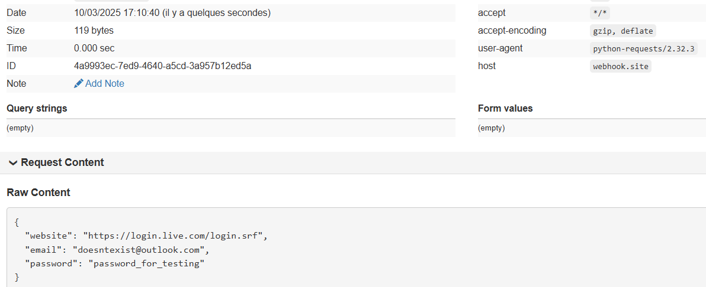

# stealthrome
POC of a Chrome Browser Password Stealer

The script decrypts and sends the passwords to a webhook:

In practice, you could exfiltrate the master key and the database file and do the decryption locally in your machine.
 The reason we create copy of the files is because they're locked since they're accessed by the Chrome process. You could kill it if you don't want to drop any files.
